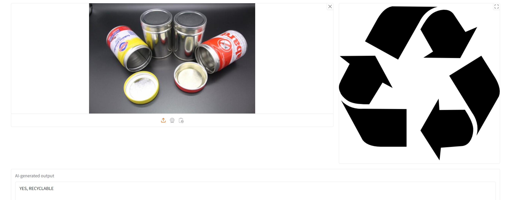
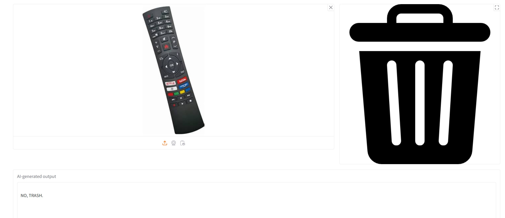

# Phi Recycling with GitHub Models

New scenario unlocked with Phi vision model to sort trash and recycling. 

The scenario is based on a potential new startup using GenAI solution.

This demo is compare using Local based models provided by the [Hugging Face model catalog](https://huggingface.co) and Models as Service using [Azure AI Model Catalog](https://ai.azure.com) or [GitHub Marketplace models](https://github.com/marketplace/models) the Azure and GitHub Models offer MaaS service. Additionally the GitHub Marketplace Models offering are FREE to utilise and offer a wide range of models for various use cases.

## Overview 
The Phi family of models shows the power of small language models.  In this demonstration, we will be using the latest version of Phi 3.5 with vision specifically.  

As small language models (SLM) are obviously smaller, the quality of image understanding may not be quite as good as with a large language model, but there are some advantages:

+ SLMs allow local execution, which is valuable for a number of reasons - lack of connectivity, latency constraints, or sharing-data-to-the-cloud concerns
+ SLMs allow you to call the model at great scale

The solution allows you to simply change the model from Phi3.5 to GPT4o 

# Company Scenario

A new scenario that small language models like Phi could unlock is **sorting trash and recycling**.  Misplacing trash into recycling bins has major financial and environmental impact.  When trash is mixed in with recyclables, it can contaminate the entire batch, which often means that the contaminated recyclables cannot be processed and end up in landfills instead.  This contributes to the growing amount of waste in landfills and exacerbates issues like soil and water pollution as well as greenhouse gas emissions from decomposing waste.  If recycling facilities have to spend additional time and resources to sort out contaminants, this increases the overall cost of recycling and makes the process less efficient.  For more information, see:
+ https://www.epa.gov/recycle/frequent-questions-recycling
+ https://www.earthday.org/how-our-trash-impacts-the-environment/
+ https://sustainabity.com/en/why-garbage-separation-matters-environmental-impact-and-benefits/

Let's imagine a School, park with trash and recycling bins as an example.  An image understanding model like Phi 3.5 with vision could decide if an item held up to a camera was trash or recyclable, so it could be disposed of properly.  The prompt could be easily modified for local recycling guidelines of the school.  Phi 3-5 can handle the enormous scale of many people throwing things away, and it could run locally without the need for network connectivity in an outdoor space or on an embedded device location near recycling facilities.  The relative cost of a large language model in the cloud plus its connectivity requirements may not make this feasible for large language models, but this is a scenario that becomes possible with a model like Phi.  

## Demo Experience

On the left side of the screen is an image placeholder.  Using the three small icons below it, you can upload a saved image, use your camera to take a picture, or paste an image from your clipboard.  After selecting an image, the model will run and determine if the item in the image is recyclable or not.  This output will be shown visually on the right side of the screen.  If it is recyclable, it will show a recycle symbol.  If it is non-recyclable, it will show a trash bin symbol.  

Here is the experience when the item can be recycled, like an Tin Cans.  


Here is the experience when the item cannot be recycled, like a electrical item, such as remote control. 

 
## Setup for CUDA compatible GPU
 
This was tested on a machine with a CUDA-compatible GPU.  Run the below ["First run" commands](#first-run) to set up the environment properly on your first run.  

[Anaconda](https://www.anaconda.com/download/) is required to download before running the commands below.
To ensure Pytorch is CUDA-compatible, you will need to run something like this in your Anaconda Prompt:

```
conda install pytorch torchvision torchaudio pytorch-cuda=11.8 -c pytorch -c nvidia
```
For the exact command for your specific CUDA version, more info is here: https://pytorch.org/

## Setup for GitHub Models

1. Create a personal access token

You do not need to give any permissions to the token. Note that the token will be sent to a Microsoft service.
To use the code snippets below, create an environment variable to set your token as the key for the client code.

If you're using bash:
```
export GITHUB_TOKEN="<your-github-token-goes-here>"
```
If you're in powershell:
```
$Env:GITHUB_TOKEN="<your-github-token-goes-here>"
```
If you're using Windows command prompt:
```
set GITHUB_TOKEN=<your-github-token-goes-here>
``
## Install dependencies

See the `requirements.txt` file for a list of dependencies.  You can install them using pip:
```

You need to ensure you have the Install the Azure AI Inference SDK using pip (Requires: Python >=3.8):
```
pip install azure-ai-inference
```

### First run of Local Model

Please ensure you run the command from the root directory of the project. The Local Model sample code is in the `localinference` directory. So ensure you switch the directory to `localinference` before running the below python command `Python recycling.py`.

 
```
conda create --name recycling python=3.10 -y
conda activate recycling
conda install pytorch torchvision torchaudio pytorch-cuda=11.8 -c pytorch -c nvidia
pip install -r requirements.txt
cd localinfernce
python recycling.py
```

### First run of GitHub Models

Please ensure you run the command from the root directory of the project. 

 
```
conda create --name recycling python=3.10 -y
conda activate recycling
conda install pytorch torchvision torchaudio pytorch-cuda=11.8 -c pytorch -c nvidia
pip install -r requirements.txt
python recycling.py
```
## Gradio issues

If you encounter issues with the UI ensure your using the latest version of Gradio 

```bash
pip install gradio --upgrade
```

```bash
pip update gradio
```

### Subsequent runs
```
conda activate recycling
python recycling.py
```
